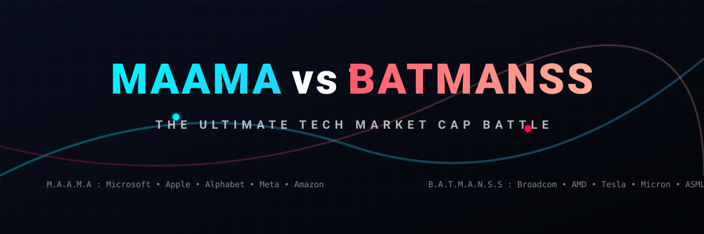

# 📊 MAAMA vs BATMANSS: Tech Giants Market Cap Comparison

  

  
  
  
  
  
  
  

A real-time comparison of the total market capitalization between two major cohorts of technology giants: **MAAMA** (Microsoft, Apple, Alphabet, Amazon, Meta) vs. **BATMANSS** (Broadcom, AMD, Tesla, Micron, ASML, Nvidia, Samsung, SK Hynix).

This repository tracks, compares, and visualizes the financial scale of the traditional consumer tech/software giants against the rising semiconductor, AI hardware, and automotive powerhouses.

---

## 📈 Market Capitalization Comparison Table

| **MAAMA Group** | **Market Cap** | **BATMANS Group** | **Market Cap** |
| :--- | :--- | :--- | :--- |
| **Apple** | ~\$4.89 Trillion | **Nvidia** | ~\$5.01 Trillion |
| **Alphabet** | ~\$3.90 Trillion | **Broadcom** | ~\$1.82 Trillion |
| **Microsoft** | ~\$2.84 Trillion | **Tesla** | ~\$1.24 Trillion |
| **Amazon** | ~\$2.50 Trillion | **Samsung** | ~\$1.12 Trillion |
| **Meta Platforms** | ~\$1.51 Trillion | **Micron Technology** | ~\$1.04 Trillion |
| | | **SK Hynix** | ~\$856 Billion |
| | | **AMD** | ~\$851 Billion |
| | | **ASML** | ~\$675 Billion |
| **TOTAL** | **~\$15.64 Trillion** | **TOTAL** | **~\$12.61 Trillion** |

---

## 💡 What is MAAMA?
**MAAMA** represents the leading mega-cap tech companies dominating consumer services, cloud hosting, software, and advertising:
* **M**icrosoft (MSFT)
* **A**pple (AAPL)
* **A**lphabet (GOOGL)
* **M**eta Platforms (META)
* **A**mazon (AMZN)

## ⚡ What is BATMANSS?
**BATMANSS** represents the critical hardware, semiconductor, and automotive companies driving the AI revolution, chip fabrication, and clean energy:
* **B**roadcom (AVGO)
* **A**MD (AMD)
* **T**esla (TSLA)
* **M**icron Technology (MU)
* **A**SML (ASML)
* **N**vidia (NVDA)
* **S**amsung Electronics (SSNLF)
* **S**K Hynix

---

## 🤝 Contributing
Contributions, issue reports, and updates to the market cap figures are welcome! Please check [CONTRIBUTING.md](file:///C:/Users/ishan/Documents/Projects/MAAMA_vs_BATMANSS/CONTRIBUTING.md) for guidelines.

## 📄 License
This project is licensed under the MIT License - see the [LICENSE](file:///C:/Users/ishan/Documents/Projects/MAAMA_vs_BATMANSS/LICENSE) file for details.

## 🌟 Star History

<a href="https://www.star-history.com/?repos=ishandutta2007%2FMAAMA_vs_BATMANSS&type=date&legend=bottom-right">
<picture>
<source media="(prefers-color-scheme: dark)" srcset="https://api.star-history.com/chart?repos=ishandutta2007/MAAMA_vs_BATMANSS&type=date&theme=dark&legend=bottom-right" />
<source media="(prefers-color-scheme: light)" srcset="https://api.star-history.com/chart?repos=ishandutta2007/MAAMA_vs_BATMANSS&type=date&legend=bottom-right" />

</picture>
</a>

